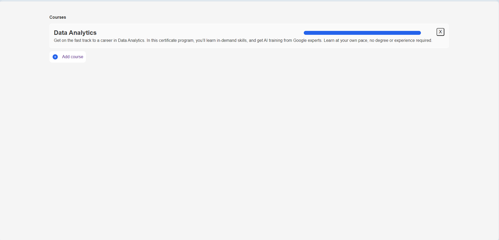
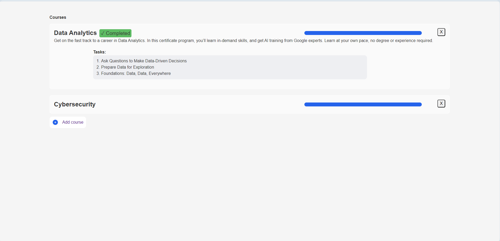
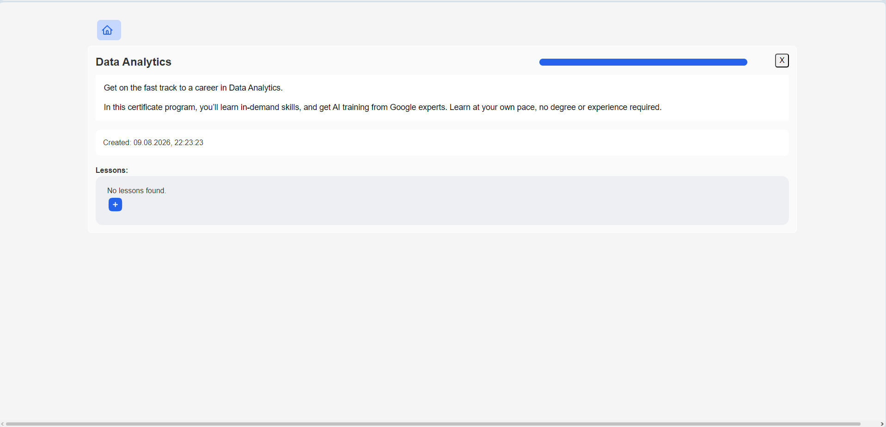
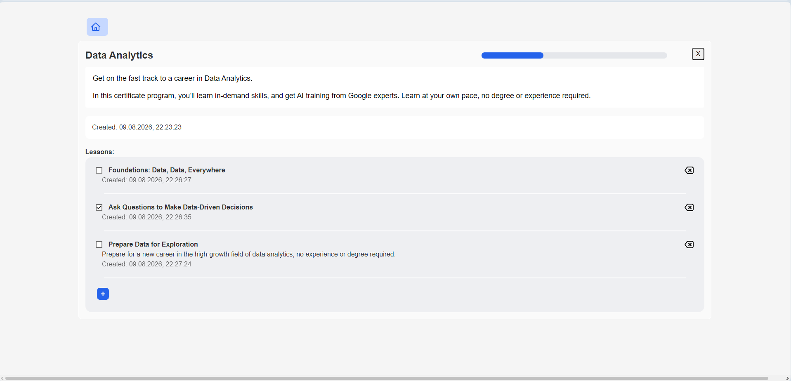
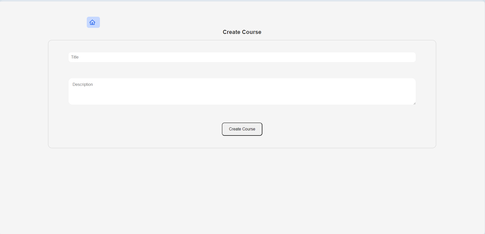
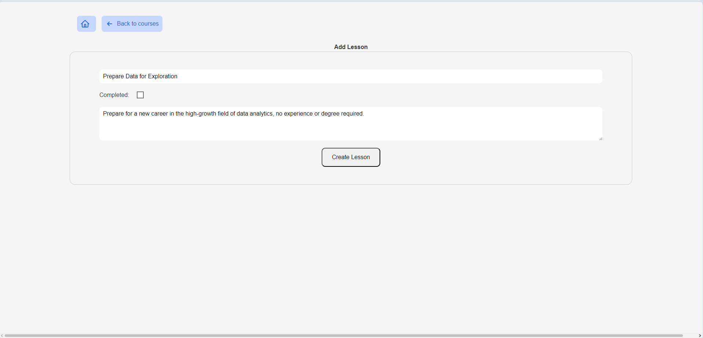

# Course Progress Tracker

## Preview

> [!NOTE]
> More technical information (about the technologies used, launch commands, etc.) is
> provided [below](#Technical-Information).

### Main page (All courses)

>→ Redirects to [the course page](#Course-Page) when the course title is clicked.  
>→ When the “+” button is clicked, the user is redirected to the ["Add Course"](#Add-Course-Page) page.

  
The page with no courses created:

  
The page with a course:

  
The page with several courses:

### Course Page
>→ When the “+” button is clicked, the user is redirected to the ["Add Lesson"](#Add-Lesson-Page) page.

Contains information about the course: its title and description (these fields can be edited), creation date, and list of lessons.
  
The course page:

  
Progress bar demonstration:

### Add Course Page

### Add Lesson Page

## Technical Information

### How to run?

Just use `docker compose up --build` (The Docker application must be running)

### Technologies used

Frontend: React + HTML + CSS
Backend: Java Spring Boot
Database: PostgresSQL
Docker: I used Docker Desktop.

## API endpoints:

| HTTP method | Related to |                  Endpoint path |
|:------------|:----------:|-------------------------------:|
| GET         |  Courses   |                       /courses |
| POST        |  Courses   |                       /courses |
| DELETE      |  Courses   |                   /courses/:id |
| PATCH       |  Courses   |                   /courses/:id |
| GET         |  Lessons   |     /courses/:courseId/lessons |
| POST        |  Lessons   |     /courses/:courseId/lessons |
| DELETE      |  Lessons   | /courses/:courseId/lessons/:id |
| PATCH       |  Lessons   | /courses/:courseId/lessons/:id |

## Database description

| Table name |    Column    |           Type           | IsNullable |
|:-----------|:------------:|:------------------------:|-----------:|
| courses    |      id      |          bigint          |         No |
| courses    |  created_at  | timestamp (w/o timezone) |         No |
| courses    | description  |           text           |        Yes |
| courses    |    title     |           text           |         No |
| lessons    |      id      |          bigint          |         No |
| lessons    |  created_at  | timestamp (w/o timezone) |         No |
| lessons    | is_completed |         boolean          |         No |
| lessons    |    title     |           text           |         No |
| lessons    |  course_id   |          bigint          |         No |
| lessons    | description  |           text           |        Yes |

*
    - the number of lessons ("numberOfLessons") and the number of completed lessons ("completedLessons") isn't saved in
      database, they are counted by backend during runtime.

## Docker description

### Ports

| Service  |   Port    |
|:---------|:---------:|
| frontend | 4000:8080 |
| backend  |  3000:80  |
| postgre  | 5432:5432 |

### Dependencies

| Service  | Depends on |
|:---------|:----------:|
| frontend |  backend   |
| backend  |  postgre   |
| postgre  |            |

### Environments

| Service  |      environment name      |             environment value              |
|:---------|:--------------------------:|:------------------------------------------:|
| backend  |   SPRING_DATASOURCE_URL    | jdbc:postgresql://postgres:5432/courses_db |
| backend  | SPRING_DATASOURCE_USERNAME |                  postgres                  |
| backend  | SPRING_DATASOURCE_PASSWORD |                  postgres                  |
| postgres |        POSTGRES_DB         |                 courses_db                 |
| postgres |       POSTGRES_USER        |                  postgres                  |
| postgres |     POSTGRES_PASSWORD      |                  postgres                  |

## What is completed

### Frontend

- [x] Course list
- [x] Form to create course
- [x] Course details page
- [x] Form to add lesson
- [x] Lesson list
- [x] Checkbox or button to mark lesson completed
- [x] Progress text or progress bar
- [x] Delete course button
- [x] Delete lesson button
- [x] Basic loading or error message

### Backend

REST API endpoints:

- [x] GET /courses
- [x] POST /courses
- [x] DELETE /courses/:id
- [x] GET /courses/:courseId/lessons
- [x] POST /courses/:courseId/lessons
- [x] PATCH /lessons/:id
- [x] DELETE /lessons/:id
- [x] GET /courses/:id
- [x] PATCH /courses/:id

Basic validation:

- [x] course.title is required
- [x] lesson.title is required
- [x] isCompleted must be boolean
- [x] lesson must belong to an existing course

### Database

Create tables:

- [x] courses
- [x] lessons

Recommended courses fields:

- [x] id
- [x] title
- [x] description
- [x] created_at

Recommended lessons fields:

- [x] id
- [x] course_id
- [x] title
- [x] is_completed
- [x] created_at

## What is not completed

Everything is completed, but I'm pretty sure I used the wrong endpoint path for “lessons” - it should be `lessons/:id`
not  `/courses/:courseId/lessons/:id`.

## How AI was used

- Generating basic code (controllers / services / lists / etc.), so I could simply modify them as needed, rather than
  spending an hour writing the same basic starting code.
- It was very helpful for debugging, especially since I don't have much experience with Docker, and writing code for it
  was a challenge for me.

## AI Usage Report

- AI tool used: ChatGPT
- What I used AI for: debugging and generating starting code (see above for more information)
- 2–3 example prompts:
  `Docker setup with React and Java Spring Boot`
  `docker-compose with postgre`
  `I need to have Course.java with [the list of variables provided in the assignment] can you create mvc with it?`

- What I changed manually:
  CSS (I just wanted some small settings).
  I didn't like the implementation of the `progress` function (frontend), so I rewrote it.
  Apart from that, it's mostly other minor, specific changes.

- What was difficult:
  About using AI - nothing. I used specific prompts, and they gave me exactly what I asked for. 